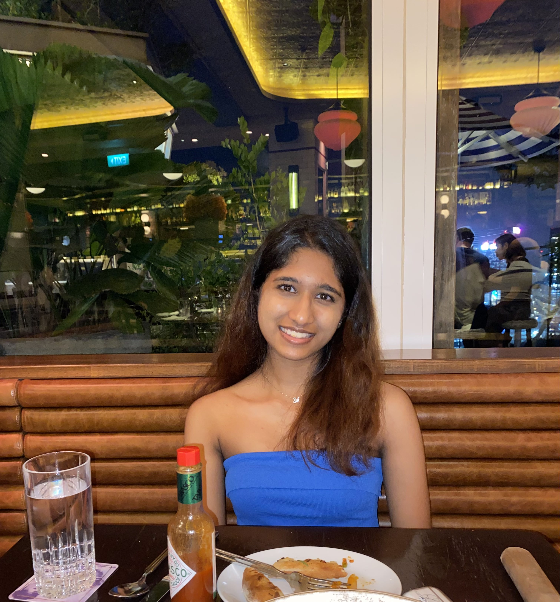

# About Us

We are a team based in the [School of Computing, National University of Singapore](http://www.comp.nus.edu.sg).

You can reach us at the email `seer[at]comp.nus.edu.sg`

## NUSearch

### Fan Ruoyu

[[github](https://github.com/frrrrry)]
[[portfolio](team/frrrrry.md)]

* Role: Developer
* Responsibilities: Documentation 

### William Jacob

[[github](http://github.com/wjacobw)]
[[portfolio](team/johndoe.md)]

* Role: Developer
* Responsibilities: Testing

### Law Rui Xi

[[github](http://github.com/lawruixi)] [[portfolio](team/lawruixi.md)]

* Role: Developer
* Responsibilities: Code Quality

### Ong Xiao Wei

[[github](http://github.com/xxiaoweii)]
[[portfolio](team/xxiaoweii.md)]

* Role: Developer
* Responsibilities: Scheduling and tracking

### Kirthigha Shanmuganantham

[[github](http://github.com/kayabuttertoastt)]
[[portfolio](team/kayabuttertoastt.md)]

* Role: Team Lead
* Responsibilities: Leader
