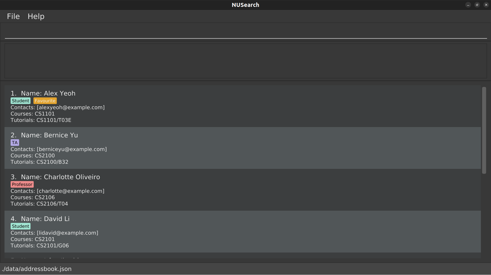

# NUSearch User Guide

NUSearch is a **desktop app for consolidating NUS professors, teaching assistants (TAs) and students’ profiles, optimized for use via a Command Line Interface** (CLI) while still having the benefits of a **Graphical User Interface (GUI)**. If you can type fast, NUSearch add and search for your NUS peers and mentors faster than traditional GUI apps.

<!-- * Table of Contents -->
<page-nav-print />

--------------------------------------------------------------------------------------------------------------------
## 1. Motivation
We aim to simplify the process of accessing academic information by developing an efficient directory app. This app will help students to consolidate professors, teaching assistants (TAs) and their fellow classmates’ profile, improving the ease of accessing the details of individuals whom the students might need to contact for that semester.

## 2. Unique Selling Point
The app helps students to consolidate important data, such as profiles of professors, teaching assistants (TAs), and fellow classmates, providing students with a single platform that is compact and easy to navigate. With this application, students can save time and energy that would otherwise be spent searching for scattered and hard-to-access essential academic contacts. The app features an intuitive and user-friendly interface, making it convenient for users to quickly find the information they need.

## 3. Quick start

1. Ensure you have Java `11` or above installed in your Computer.

2. to be added

3. Refer to the [Features](#features) below for details of each command.

--------------------------------------------------------------------------------------------------------------------

## 4. Features & Commands

### A Guide to reading each command
The description of each command will contain the following: 

##### WHAT IT DOES:
Tells you the basic idea of what the command does. 

##### FORMAT:
It specifies how the command should be formatted. You should follow the format specified to ensure that the command gives the desired output.
 
##### EXAMPLE COMMAND:
Gives you a few examples of how the command can be used for reference.

##### ACCEPTABLE VALUES:
Describes the accepted values used in a command field, specifying any restrictions. Values for the command must satisfy the restrictions for the command to be accepted.

##### EXPECTED OUTPUT ON SUCCESS:
Describes the desired output that you would see when the command is valid.

##### EXPECTED OUTPUT ON FAILURE:
Shows the error messages that will be shown to you if an invalid command is given.

### How to interpret a command format

##### COMMAND FORMAT
```
command --specifier INPUTFIELD [--specifier INPUTFIELD1, ...] [--specifier INPUTFIELD1/SUBFIELD1
-SUBFIELD2-..., ...]
```

##### EXAMPLE COMMAND FORMAT
```
add --name NAME [--role ROLE1, ...]  [--contact CONTACT1, ...] [--course COURSECODE1/CLASS1
-CLASS2-..., ...] 
```

| Command Types |          Examples           | What they mean                                                                                              |
|:-------------:|:---------------------------:|-------------------------------------------------------------------------------------------------------------|
|   `command`   |            `add`            | The name of the command. It is in bold in the format.                                                       |
| `--specifier` |          `--name`           | The specifier of the field to indicate the field type.                                                      |
| `INPUTFIELD`  |           `NAME`            | The content of the INPUT FIELD the user wants to input.                                                     |
|     `...`      |       `CONTACT1, ...`       | Ellipses indicate that the field can accept multiple values.                                                |
| ` [ ] ` | `[--contact CONTACT1, ...]` | Square brackets indicate an optional field. The user can input these fields if they want to in the command. |
| `, ` |       `CONTACT1, ...`       | Comma separates the multiple INPUTFIELDs                                                                    |
| `INPUTFIELD/SUBFIELD` |     `COURSECODE/CLASS`      | Slash indicates that this INPUTFIELD can have a SUBFIELD. This SUBFIELD is optional.                        |
| `SUBFIELD1-SUBFIELD2` |    `CLASS1-CLASS2-...`      | Dash separates the multiple SUBFIELDs.                                                                      |

##### VALID SPECIFIERS

|  Specifier  | Purpose                                          |
|:-----------:|--------------------------------------------------|
|  `--name`   | The name of the person you are adding            |
|  `--role`   | The role of the person you are adding            |
| `--contact` | The contact details of the person you are adding |
| `--course`  | The course the person is taking                  |


### Features

#### Viewing help : `help`

Shows a message which will give you the url to the help page.

##### FORMAT: 
`help`

##### EXAMPLE COMMAND: 
`help`

##### ACCEPTABLE VALUES: 
This command does not accept any parameters.

##### EXPECTED OUTPUT ON SUCCESS:
Upon successfully executing the help command, you should see a message that provides the URL to the help page. 
The help page is a comprehensive documentation containing a list of valid commands and how to use them.


##### EXPECTED OUTPUT ON FAILURE:
`The  command or the format of the command that you have entered is wrong.
Please refer to this link for the list of valid commands:`
[Help Page URL](https://se-education.org/addressbook-level3/UserGuide.html)

#### Adding a person: `add`

Adds new profiles in the profile lists.

##### FORMAT:
`add --name NAME [--role ROLE1, ...]  [--contact CONTACT1, ...] [--course COURSECODE1/CLASS1-CLASS2-..., ...] `

<box type="tip" seamless>

**Tip:**

-Contacts can be any type of contact: email address, telegram handle, phone number, etc.

-Courses can be any of the courses offered by NUS

> 📝Note:
> 
> Please use a comma (,) to separate the different contacts as well as the different courses

-The different fields are colour-coded to differentiate between them.

-The user can press tab to auto fill commands.

-The square brackets, [ ], are not needed when entering the command (see example below for more details)

</box>

##### EXAMPLE COMMAND:
`add --name Aiken Dueet --role STUDENT --contact @aikendueet, aikendueet@gmail.com 
--course CS2103T/Tut8, CS2101/G06, CS2100/Lab40-Tut30 `

##### ACCEPTABLE VALUES:
`NAME`: Any non-empty input of alphabetical characters.

`ROLE1`: Any three roles allowed here: student, ta, professor (all in lowercase).

`CONTACT1`: Any non-empty input of characters.

`COURSECODE1`: Any non-empty input of characters.

`CLASS1`: Any non-empty input of characters.

##### EXPECTED OUTPUT ON SUCCESS:
```
You have added a new profile in :)
Name: Aiken Dueet  
Role: STUDENT
Contact: @aikendueet, aikendueet@gmail.com
Course: CS2103T, CS2101, CS2100
Tutorials: CS2103T/Tut8, CS2101/G06, CS2100/Lab40-Tut30
```


##### EXPECTED OUTPUT ON FAILURE:
`The  command or the format of the command that you have entered is wrong.
Please refer to this link for the list of valid commands:`
[Help Page URL](https://se-education.org/addressbook-level3/UserGuide.html)


#### Listing all persons : `list`

List all the profiles added by the user.

##### FORMAT:
`list`

##### EXAMPLE COMMAND:
`list`

##### ACCEPTABLE VALUES:
This command does not accept any parameters.

##### EXPECTED OUTPUT ON SUCCESS:
```
You have 1 profile in your list: 
Name: Aiken Dueet  
Role: STUDENT
Contact: @aikendueet, aikendueet@gmail.com
Course: CS2103T, CS2101, CS2100
Tutorials: CS2103T/Tut8 , CS2101/G06, CS2100/Lab40-Tut30 
```

##### EXPECTED OUTPUT ON FAILURE:
`The  command or the format of the command that you have entered is wrong.
Please refer to this link for the list of valid commands:`
[Help Page URL](https://se-education.org/addressbook-level3/UserGuide.html)


#### Editing a person : `edit`

Edits an existing person in the address book.

Format: `edit INDEX [n/NAME] [p/PHONE] [e/EMAIL] [a/ADDRESS] [t/TAG]…​`

* Edits the person at the specified `INDEX`. The index refers to the index number shown in the displayed person list. The index **must be a positive integer** 1, 2, 3, …​
* At least one of the optional fields must be provided.
* Existing values will be updated to the input values.
* When editing tags, the existing tags of the person will be removed i.e adding of tags is not cumulative.
* You can remove all the person’s tags by typing `t/` without
    specifying any tags after it.

Examples:
*  `edit 1 p/91234567 e/johndoe@example.com` Edits the phone number and email address of the 1st person to be `91234567` and `johndoe@example.com` respectively.
*  `edit 2 n/Betsy Crower t/` Edits the name of the 2nd person to be `Betsy Crower` and clears all existing tags.

#### Locating persons by name: `find`

Finds persons whose names contain any of the given keywords.

Format: `find KEYWORD [MORE_KEYWORDS]`

* The search is case-insensitive. e.g `hans` will match `Hans`
* The order of the keywords does not matter. e.g. `Hans Bo` will match `Bo Hans`
* Only the name is searched.
* Only full words will be matched e.g. `Han` will not match `Hans`
* Persons matching at least one keyword will be returned (i.e. `OR` search).
  e.g. `Hans Bo` will return `Hans Gruber`, `Bo Yang`

Examples:
* `find John` returns `john` and `John Doe`
* `find alex david` returns `Alex Yeoh`, `David Li`<br>
  

#### Deleting a person : `delete`

Deletes the specified person from the address book.

Format: `delete INDEX`

* Deletes the person at the specified `INDEX`.
* The index refers to the index number shown in the displayed person list.
* The index **must be a positive integer** 1, 2, 3, …​

Examples:
* `list` followed by `delete 2` deletes the 2nd person in the address book.
* `find Betsy` followed by `delete 1` deletes the 1st person in the results of the `find` command.

#### Clearing all entries : `clear`

Clears all entries from the address book.

Format: `clear`

#### Exiting the program : `exit`

Exits the program.

Format: `exit`

#### Saving the data

AddressBook data are saved in the hard disk automatically after any command that changes the data. There is no need to save manually.

#### Editing the data file

AddressBook data are saved automatically as a JSON file `[JAR file location]/data/addressbook.json`. Advanced users are welcome to update data directly by editing that data file.

<box type="warning" seamless>

**Caution:**
If your changes to the data file makes its format invalid, AddressBook will discard all data and start with an empty data file at the next run.  Hence, it is recommended to take a backup of the file before editing it.
</box>

#### Archiving data files `[coming in v2.0]`

_Details coming soon ..._

--------------------------------------------------------------------------------------------------------------------

## UI Mockup

Here's a mockup of how the User Interface might look: <br>



--------------------------------------------------------------------------------------------------------------------

## FAQ

**Q**: How do I transfer my data to another Computer?<br>
**A**: Install the app in the other computer and overwrite the empty data file it creates with the file that contains the data of your previous AddressBook home folder.

--------------------------------------------------------------------------------------------------------------------

## Known issues

1. **When using multiple screens**, if you move the application to a secondary screen, and later switch to using only the primary screen, the GUI will open off-screen. The remedy is to delete the `preferences.json` file created by the application before running the application again.

--------------------------------------------------------------------------------------------------------------------

## Command summary

Action     | Format, Examples
-----------|----------------------------------------------------------------------------------------------------------------------------------------------------------------------
**Add**    | `add n/NAME p/PHONE_NUMBER e/EMAIL a/ADDRESS [t/TAG]…​` <br> e.g., `add n/James Ho p/22224444 e/jamesho@example.com a/123, Clementi Rd, 1234665 t/friend t/colleague`
**Clear**  | `clear`
**Delete** | `delete INDEX`<br> e.g., `delete 3`
**Edit**   | `edit INDEX [n/NAME] [p/PHONE_NUMBER] [e/EMAIL] [a/ADDRESS] [t/TAG]…​`<br> e.g.,`edit 2 n/James Lee e/jameslee@example.com`
**Find**   | `find KEYWORD [MORE_KEYWORDS]`<br> e.g., `find James Jake`
**List**   | `list`
**Help**   | `help`
